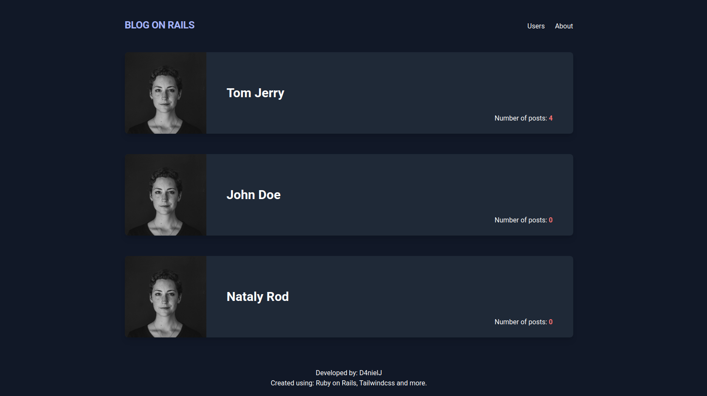

# Blog App in Rails

> The Blog app is a classic example of a blog website.

The Blog app is a classic example of a blog website. Fully functional website that shows the list of posts and empower readers to interact with them by adding comments and likes.

## Built With

- Ruby on Rails
- Devise
- Tailwindcss

<!-- ## Live Demo

[Live Demo Link](https://livedemo.com) -->

## Getting Started

**This is an example of how you may give instructions on setting up your project locally.**
**Modify this file to match your project, remove sections that don't apply. For example: delete the testing section if the currect project doesn't require testing.**

To get a local copy up and running follow these simple example steps.

### Prerequisites

- Ruby
- Rails
- Yarn
- Postgresql
- Node.js

### Setup

- Clone this repo
- Cd to folder
- Run `bundle install`
- Run `rails db:setup`

### Usage

- To have fast reload enabled, run: `./bin/webpack-dev-server` before starting the server.
- Run `rails s` to start server
- Open `localhost:3000` in your web browser

### Troubleshooting

If you encounter any issues with webpacker, try to run `bundle exec rake webpacker:install`

## Authors

👤 **Daniel Jaramillo**

- GitHub: [@d4nielj](https://github.com/d4nielj)
- Twitter: [@d4niel_jm](https://twitter.com/d4niel_jm)
- LinkedIn: [d4nielj](https://linkedin.com/in/d4nielj)

## 🤝 Contributing

Contributions, issues, and feature requests are welcome!

Feel free to check the [issues page](../../issues/).

## Show your support

Give a ⭐️ if you like this project!

## 📝 License

This project is [MIT](./LICENSE) licensed.
